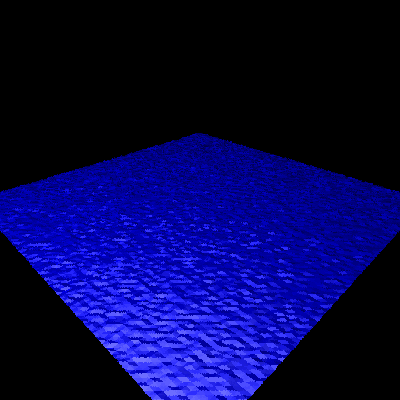
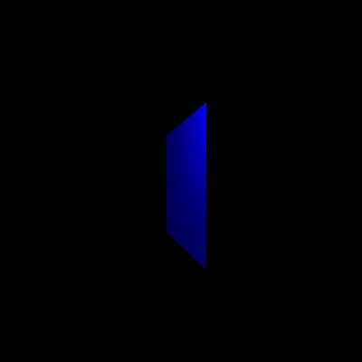
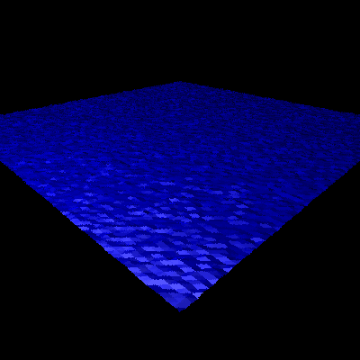

# ISIM: Cloth Simulation

A cloth physics simulation and a **ray tracer, both written from scratch in C++20** with no external library. The cloth is simulated with a mass-spring model integrated with Verlet, then each frame is rendered by the ray tracer.

| 4 corners pinned | Wind | Sphere collision |
|:--:|:--:|:--:|
|  |  |  |

## Highlights

- **Cloth physics**: 100×100 particle grid linked by structural, shearing and bending constraints, integrated with Verlet
- **Collisions** with a sphere, with Coulomb friction
- **Custom ray tracer**: Phong shading (ambient, diffuse, specular), hard shadows, recursive reflections, spheres and triangles, multithreaded
- **No dependencies**: only the C++ standard library

## How it works

**Simulation.** Each step does three things:

1. **Integrate motion** (Verlet): new particle positions from the forces (gravity, wind)
2. **Enforce distance constraints**, iteratively:
   - *structural* (direct neighbours): keeps the overall topology
   - *shearing* (diagonal neighbours): stops the cloth from collapsing sideways
   - *bending* (neighbours 2 apart): stops the cloth from folding perfectly in half
3. **Enforce collisions**: a particle inside the sphere is projected onto its surface, with friction applied

**Rendering.** The cloth is converted to triangles, and the ray tracer renders each frame (400×400) to a PPM image, one thread per image row.

## Getting started

Requirements: CMake ≥ 3.21 and a C++20 compiler

```bash
git clone https://github.com/Zarvork/ISIM.git
cd ISIM
cmake -B build
cmake --build build
./build/cloth_simulation
```

The program writes one image per frame in the current directory (`test_000.ppm`, `test_001.ppm`, ...). To turn them into a video:

```bash
ffmpeg -framerate 30 -i test_%03d.ppm cloth.mp4
```

The three scenarios (cloth falling on a sphere, cloth pinned by 4 corners, flag in the wind) are in `main()` of `engine.cpp`. Uncomment the one you want to run.

## Limitations

- No self-collision
- Collisions only with spheres (no floor, boxes...)
- Not real-time, because of the ray tracer

## Simulation parameters

All parameters are variables at the top of each scenario in `main()` (`engine.cpp`).

## Physics

| Parameter | Description |
|---|---|
| `mass` | Mass of each particle |
| `damping` | How quickly the simulation loses energy. The higher the value, the *less* energy the cloth loses. It is given per image (`damping_global`) and converted to a per-step value: `damping_global^(1 / nb_steps)` |
| constraint iterations | Number of iterations of the constraint loop. The higher the value, the stiffer the cloth |
| `wind` | Enables or disables the wind force |

## Cloth geometry

| Parameter | Description |
|---|---|
| `width` / `height` | Size of the cloth, in particles (`grid_size` in the scenarios) |
| `spacing` | Distance between two neighbouring particles |
| `is_xz_plane` | `true`: cloth lies in the XZ plane. `false`: XY plane |

## Time and output

| Parameter | Description |
|---|---|
| `num_frames` | Number of images to generate |
| `time_between_image` | Time interval between two generated images (`0.033` = 30 FPS) |
| `delta_time` | Time step of one physical step |
| `nb_steps` | Number of physical steps computed between two images (`time_between_image / delta_time`). The higher the value, the faster the simulation progresses visually |

## Authors

- Anis Feore
- Lucil Finkelstein
